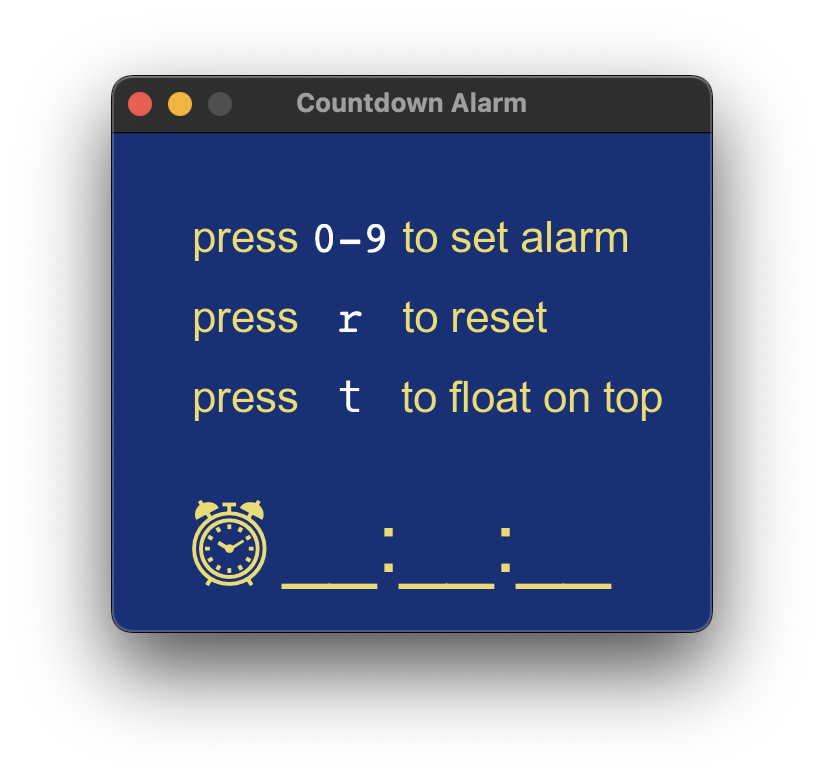
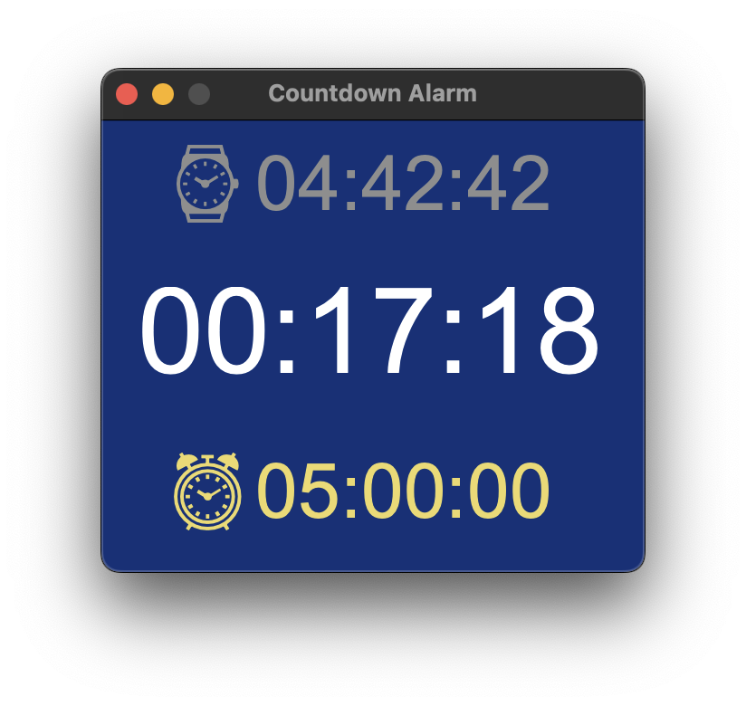

An alarm with countdown.

  

To use this application, you need [CALM](https://vitovan.com/calm/) and [Noto Emoji](https://fonts.google.com/noto/specimen/Noto%2BEmoji) (before I released the binaries).
